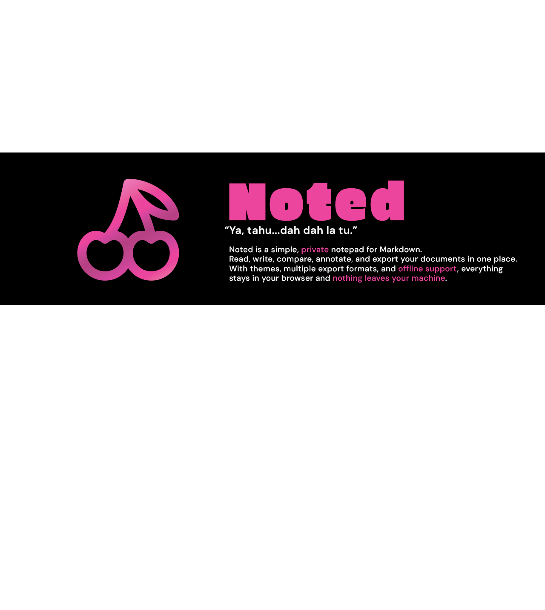

# Noted™

**Noted is a simple, private notepad for Markdown and Word documents.**

Open, read, write, compare, annotate, and export your documents in one place. Everything runs in your browser, works offline, and nothing leaves your machine.

**[Try it live →](https://forageopen.github.io/Noted/)**

## v1 feature set

- **Load**: drag-and-drop or browse for a `.md` or `.docx` file.
- **Viewer**: rendered Markdown, default view.
- **Copy**: one click to copy the file's content.
- **Theme**: Sakura (light pink/burgundy) / Cherry (charcoal/neon pink) toggle.
- **Edit tab**: 18-color highlighter, paragraph styles, bold/italic/underline/strikethrough.
- **Export**: `.html`, `.pdf`, `.docx`, `.md`, `.json`.
- **Dual window**: two independent panes, side by side, for comparing two files.
- **Offline mode**: opt-in, self-updating cache.

See `docs/product/PRODUCT-SPEC.md` Section 3 for the full scope (and what's deliberately out of v1).

## Governing documents

| Document | Answers |
|---|---|
| [`PRODUCT-PRINCIPLES.md`](docs/product/PRODUCT-PRINCIPLES.md) | Why - ABIM method, MVD filter, Noted's design concept and operating principle |
| [`PRODUCT-SPEC.md`](docs/product/PRODUCT-SPEC.md) | What - identity, architecture, feature set, criteria |
| [`PRODUCT-ROADMAP.md`](docs/product/PRODUCT-ROADMAP.md) | When - v1 scope, draft future phases |
| [`PRODUCT-DECISIONS.md`](docs/product/PRODUCT-DECISIONS.md) | Who decides, and how - roles, decision boundaries, ADR log |

Read `REPO-STANDARD.md` before modifying this repository.

## Credits

- **Adam Rosman** — Founder, Forage. Product direction and every material decision recorded in this repo (see `docs/product/PRODUCT-DECISIONS.md`).
- **Claude (Anthropic)** — AI pair-programmer. Drafted the docs, app, and everything currently in `src/` under the Founder's direction. Flagging the honest mismatch rather than papering over it: GitHub's "Contributors" graph is commit-authorship-based and tied to a real account, which Claude doesn't have - so this line is the accurate record, not that graph. Commits authored with Claude's involvement carry a `Co-Authored-By: Claude <noreply@anthropic.com>` trailer.

## License

MIT - see [`LICENSE`](LICENSE).
